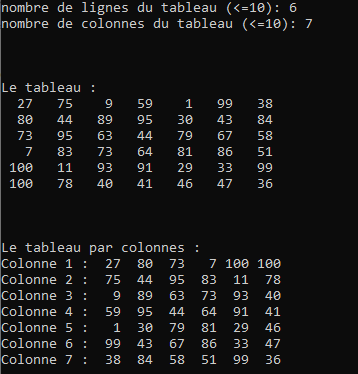

# Exercice 2 : AFFICHAGE D’UN TABLEAU LIGNE PAR LIGNE ET COLONNE PAR COLONNE

+ *Déclarer un tableau `t` carré d'ordre N.*
+ *Tirer au hasard 2 nombres entiers `m` et `n`, tous deux entre 2 et N. Il s'agira des nombres de lignes et de colonnes utiles du tableau `t`.*
+ *Initialiser `t` dans le `main()` avec des valeurs aléatoires comprises entre **1** et **100**, par indices.*
+ *Afficher ces éléments ligne par ligne, via une fonction qui reçoit `t` en paramètre.*
+ Afficher ces éléments colonne par colonne («colonne 1: ... / colonne 2: ...»), via une fonction qui reçoit t en paramètre.
+ Exemple :

NB : Les lignes en italiques sont les mêmes que dans l'énoncé 1 (#reusecode ;-))
