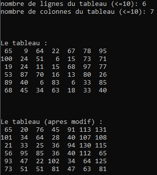

# Exercice 3 : +1, +2, +3, ETC. EN ZIG-ZAG

+ *Lire `n` et `m`, les nombres de lignes et de colonnes d'un tableau `t`.*
+ *L'initialiser dans le `main()` avec des valeurs aléatoires comprises entre **1** et **100**, par indices.*
+ *Afficher ces éléments ligne par ligne, via une fonction qui reçoit `t` par pointeur.*
+ Parcourir ce tableau en zig-zag (= colonne par colonne, une colonne on descend, la suivante on remonte etc.) et à chaque nouvelle case parcourue incrémenter celle-ci du nombre de déplacements effectués. Ceci, via une fonction qui reçoit t par pointeur.
+ *Afficher ces éléments ligne par ligne, via une fonction qui reçoit `t` par pointeur.*
+ Exemple :

NB : Les lignes en italiques sont les mêmes que dans l'énoncé 1 (#reusecode ;-))
