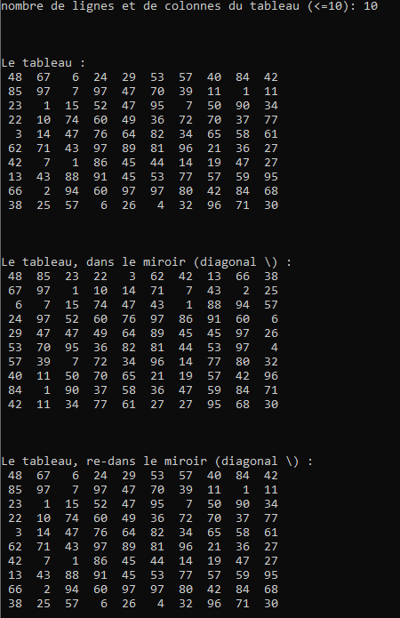

# Exercice 3 : MIROIR SUR LA DIGONALE

+ Lire `o`, le nombres de lignes et de colonnes d'un tableau (carré) `t`.
+ *L'initialiser dans le `main()` avec des valeurs aléatoires comprises entre **1** et **100**, par indices.*
+ *Afficher ces éléments ligne par ligne, via une fonction qui reçoit `t` par pointeur.*
+ Intervertir les valeurs en se servant de la diagonale principale comme miroir, par indices.
+ *Afficher ces éléments ligne par ligne, via une fonction qui reçoit `t` par pointeur.*
+ Intervertir les valeurs en se servant de la diagonale principale comme miroir, via une fonction qui reçoit `t` par pointeur.
+ Exemple :

NB : Les lignes en italiques sont les mêmes que dans l'énoncé 1 (#reusecode ;-))
