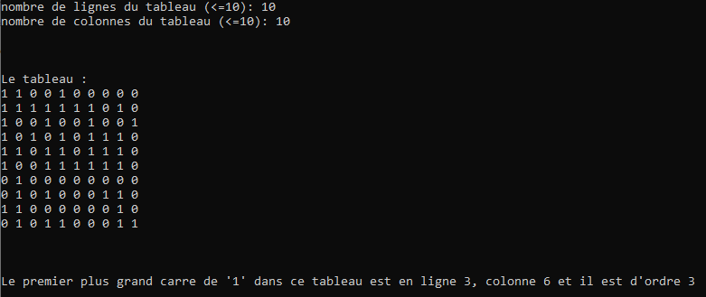

# Exercice 5 : LE PLUS GRAND CARRE DE 1 (facultatif)

+ Lire `n` et `m`, les nombres de lignes et de colonnes d'un tableau `t`.
+ L'initialiser dans le `main()` avec des valeurs entières aléatoires comprises entre **0** et **1**, via une fonction qui reçoit `t` en paramètre.
+ *Afficher ces éléments ligne par ligne, via une fonction qui reçoit `t` en paramètre.*
+ Trouver le plus grand carré de *1* (composé uniquement de 1) et retourner les coordonnées du coin supérieur gauche et la taille du carré, via une fonction qui reçoit t en paramètre.
+ Afficher les coordonnées (les indices i et j) et la taille du carré trouvés.

+ Exemple :

NB : Les lignes en italiques sont les mêmes que dans l'énoncé 1 (#reusecode ;-))
